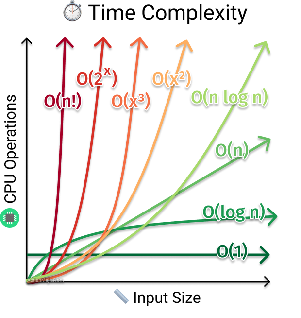

# Questions 

## Big O

[Link](https://www.metacareers.com/profile/preparation_hub?c=559389189759409&chooseView=Big+O)

### Tips and Tricks

- Include all things.
- Use logical variable name.
- Define the variables you need.
- Add runtimes when one step is done, then another step.
- Adding vs. multiplying. (O(a+a+d) = O(2a+d) = O(a+b)).
- Drop constants.
- Use big O for space. Remember the call stack!
- Drop non-dominant terms.

Others:
- Keep in mind big O as you solve problems
- Generally looking for the best time and space complexity
- A lower big O doesn't mean always faster. It means faster when the is sufficiently large. It is about SCALE!

## Problem Solving

### The Seven Steps

1. Listen... for clues. 
2. Draw an example. Input and output. Large and generic examples. (Your brain must work for it.)
3. Brute force. (When struggling, what is a stupid way doing this. Then find time and space complexity and hold back.) 
4. Optimize before write code.
5. Walk through algo. Before start to code. Nail down the details!
6. Code.
7. Verification. Last improvements: style, maintainabity. Like a code review.

### Optimizing with BUD

BUD: Bottlenecks - Unnecessary Work - Duplicated Work 

- Bottlenecks.
- Unnecessary Work.
- Duplicated Work.

### Optimize with Space and Time

- There are trade-offs. We can sacrifice time for space. 
    - Hash tables
    - Pre-computation
    - Tries
- Best conceivable runtime: What runtime I cannot beat?

### Optimize with DIY

- Come up with a good example (large & generic, no special cases), then figure out the output.
- Pay attention short circuiting or tricks you use. 

## Coding

[Link](https://www.metacareers.com/profile/preparation_hub?c=559389189759409&chooseView=Coding)

### Coding expectations

- Do not rush into the code.
- Start, when you are ready and the interview is ready.

### Tips and Tricks

- Don't just dive in. Make sure you know the little details. Wait until you and your interviewer are ready. 
- Algorithm details, data structure, indices, etc.
- Demonstrate that you are a great coder:
    - correctness
    - readability
    - maintainability
    - performance
- Use the neat features of your programming language. 
    - Ask if you are not sure
    - Can often "make up" reasonable functions (or assume at first and implement later)
    - Use good style (consistent spaces etc.)
    - Think about error cases, boundary checks, etc.

### Coding - Structured Code

- Structuring your code makes it more readable, maintainable, etc. AND makes life easier
- Modularize code top down, filling in the next most interesting piece of code
- Ignore things that don't show good signal (but check with your interviewer first)
- Focus on what shows signal

## Verification

- Your original example is generally not a good test case
- Good examples are large, and large test cases take a very long time to run through.

### Tips and Tricks

1. Conceptual walk though to your interviewer.
2. Hot spots. Where the high risk lines of code?
    - Math
    - Moving indices
    - Parameters when calling recursion
    - Base cases
    - and so on!
3. Test cases: 
    - Start with small cases.
    - Edge cases: 
        - boring edge cases
        - interesting edge cases
    - Big test cases (if you have time)
    
### Common Mistakes

1. Verifying algorithm, not code.
2. Blindly testing, without thinking about what's happening.
3. Quick, sloppy fixes.

## Communication

[Link](https://www.metacareers.com/profile/preparation_hub?c=559389189759409&chooseView=Communication) 

- Drive through the problem
- Show your thought process
- Ask questions
- Propose initial solution, but also think about its issues

## Hash Tables

[Links](https://www.metacareers.com/profile/preparation_hub?c=559389189759409&chooseView=Hash+Tables)

### Tips and Tricks
- Listen for:
  - Lookups, counting how many times.
- Patterns & Concepts:
  - Implementation. How do we handle collision? 
  - Hash codes. What are they  and how do we use them?
  - Keys. What should my key be?
- Syntactical Details:
    - Creation, access, check contains, delete
- Stumbling Block
    - Key isn't in hash table
- Extras
    - Hash table or hash set?
    - Character frequency table.
    - BitMap (0/1 -> true/false)

### Questions

1. Megan is implementing a hash table from scratch. She has chosen to handle collisions through chaining: if two items collide at the same index in the underlying array, they are put into a linked list. If her hash table maps from strings to Person objects, which would be most appropriate data type for the linked list?

- A linked list of Person objects
- -> A linked list of (string, Person) objects
-  A linked list of strings

## Search

[Link](https://www.metacareers.com/profile/preparation_hub?c=559389189759409&chooseView=Search)

You know what binary search is.

### Tips and Tricks
- Listen for:
    - Sorted data
    - Guesses can be over / under estimated
- Syntactical Details:
    - Implementing binary search  from scratch and & with library
- Patterns & Concepts:
    - Modification of binary search
- Stumbling Blocks:
    - Left, right, middle indices
    - Middle computation
    - Flooring? (len(x)//2 in python)
- Extras
    - Practice

### Questions
1. While engineers often think about binary search recursively, the algorithm is often implemented iteratively. Why?

    - It reduces the time complexity significantly.
    - None of the above.
    - --> It reduces the space complexity significantly.
    - The iterative implementation is much simpler.

2. In which of the following scenarios might the runtime of binary search degenerate?

    - The array is a consecutive sequence of numbers.
    - The array has many duplicates.
    - The array has a large span across the values, for example, ranging from -1000000000 to 1000000000
    - --> None of the above.

## Sorting

[Link](https://www.metacareers.com/profile/preparation_hub?c=559389189759409&chooseView=Sorting)

### Tips and Tricks

### Questions

1. You’re working in a mysterious programming language and you notice that array.sort is usually pretty fast, even with a large dataset. (That is, it seems comparable to sorts running with O(N log N) time complexity.) However, when applied to an array that’s already sorted, this array.sort becomes much slower. Which of the following sorting algorithms is most likely to be underlying array.sort?

    - Selection Sort
    Why Not Suitable: Selection sort has a time complexity of O(N^2) in all cases (best, average, and worst). It does not exhibit the behavior of being fast on average but slow on already sorted arrays. It is consistently slow for large datasets.
    - Quicksort
    Why Suitable: Quicksort has an average-case time complexity of O(N log N), which makes it fast for most datasets. However, its worst-case time complexity is O(N^2), which occurs when the pivot selection is poor, such as when the array is already sorted or nearly sorted. This matches the described behavior of array.sort.
    - Mergesort
    Why Not Suitable: Mergesort has a time complexity of O(N log N) in all cases (best, average, and worst). It is consistently efficient and does not become significantly slower for already sorted arrays. Therefore, it does not match the described behavior.
    - Bubble Sort
    Why Not Suitable: Bubble sort has a worst-case and average-case time complexity of O(N^2). However, its best-case time complexity is O(N) when the array is already sorted. This means it would actually be faster, not slower, for already sorted arrays, which does not match the described behavior.

2. Your friend is concerned about using quicksort in your code, stating that the runtime will degenerate if the array is already sorted. Which might be the best fix for this issue?

    Randomized Pivot: Randomly select a pivot element to reduce the likelihood of encountering the worst-case scenario.

    Improves Average Performance: Randomized pivot selection ensures that, on average, the partitions are more balanced, leading to an average-case time complexity of O(N log N).

3. You have an array of length N representing humans, and you want to sort the people by their age (integers between 0 and 150). What is the best runtime for this problem?

    Using counting sort. 
    Which is very efficient for O(n).

    The range of ages (0 to 150) is small and fixe

    It is a non-comparative sorting algorithm, making it faster than comparison-based algorithms for this specific case.

    The best runtime for sorting the array of humans by their age using counting sort is O(N + k), which in this case simplifies to O(N) since k (the range of ages) is a constant (151).

## Recursion

[Link](https://www.metacareers.com/profile/preparation_hub?c=559389189759409&chooseView=Recursion)

### Tips and Tricks
  - Listen for: 
    - Choices: Do I go left or right?
    - Superlatives: Biggest, longest, shortest, all 
    - Divide and conquer: Can you solve for parts seperately?
    

  - Patterns & concepts: 
    - Tip: Tell  your interviewer if you think it is recursive.
    - All recursive can be iteratively!
    - Space complexity! Stack!
    - Trust and merge
    - Damage and repair. E.g. visited

  - Stumbling Blocks
    - Null empty, 1 or 2 elements, ...
    - Base cases: Keep them simple as possible

  - Extras
    - Practice!

### Questions 

  - Fibonacci: Time: O(2^N) (tree structure: #branches^(depth)), Space: O(n) coz of the stack
  - Factorial:Time and Space: O(n) because of stack

1. You are asked to change an algorithm, usually implemented recursively, into an iterative algorithm. What of the following data structures would you be most likely to use?

Stack

2. You have implemented some recursive algorithm on a balanced binary search tree, which, in part, requires recursing on the left and then recursing on the right (similar to an in-order traversal). If there are N nodes in the tree, which of the following is true about your space complexity?

It is at least O(log N), but could be worse.

3. In which of the following scenarios would you be most likely to use recursion?

    - Computing all permutations of a string

        Most Likely to Use Recursion: Generating all permutations of a string is a classic problem that is naturally suited to recursion. Each recursive call can fix one character and recursively generate permutations of the remaining characters.

    - Finding all instances of the substring p within the string s

        Not Likely to Use Recursion: This problem is typically solved using iterative methods or string matching algorithms like the Knuth-Morris-Pratt (KMP) algorithm or the Boyer-Moore algorithm, rather than recursion.

    - Generating all possible binary numbers from the integers from 1 to N

        Not Likely to Use Recursion: This problem can be efficiently solved using iterative methods or bit manipulation techniques. Recursion is not typically used for generating binary numbers in this context.

    - Breadth-first search of a graph to determine the shortest path from A to B

        Not Likely to Use Recursion: Breadth-first search (BFS) is typically implemented using a queue and iterative methods. Recursion is more commonly associated with depth-first search (DFS).

## Stacks

[Link](https://www.metacareers.com/profile/preparation_hub?c=559389189759409&chooseView=Stacks)

### Tips and Tricks
  - Listen for:
    - LIFO: Last in, First out.
    - Reversing steps. Going backwards.
  - Syntactical details:
    - Using a stack: pop, push, peek

  - Patterns & Concepts
    - Augment stack class: minimum element
    - Class vs. data: Do I get acces to the Node, or just the Stack class?

  - Stumbling Blocks:
    - Empty Stacks

  - Extras
    - Great practice question: Implement a queue class using a stack class? Tip: You can use up to two stacks to mimic a queue.

### Questions

1. Which of the following statements are true about stacks?

    They operate according to the LIFO (last-in-first-out) principle

2. Imagine you have a stack S, with 10 elements. You clone S to create stack T. Then, you call T.pop() 10 times, pushing the result onto a stack U. Which of the following statements is true?

 - Initial State:
    - Stack S: [a, b, c, d, e, f, g, h, i, j] (top to bottom)
    - Stack T: [a, b, c, d, e, f, g, h, i, j] (top to bottom, same as S)
  - After Popping from T and Pushing to U:
    Stack T (after 1st pop): [b, c, d, e, f, g, h, i, j]
    - Stack U (after 1st push): [a]
    - Continue this process until T is empty and U has all elements.
  - After 10 pops and pushes:
    - Stack T: []
    - Stack U: [j, i, h, g, f, e, d, c, b, a] (top to bottom)

## Queue

[Link](https://www.metacareers.com/profile/preparation_hub?c=559389189759409&chooseView=Queues)

### Tips and Tricks
- Listen For:
    - FIFO: first in, first out.
    Process items in the order they appear.
- Syntactical Details
    - Built-in queue data structure.
- Patterns & Concepts
    - Using linked list as a queue.
- Stumbling Blocks
    - Empty list
    - Single Element list
    - Updating head and tail
- Extras:
    - When to use queue, linked list, stacks etc. 
    - Implement queue from scratch

### Questions

1. A queue is an abstract data type, which means that the requirements are specified but not the implementation. Your friend argues that it might be easy to implement a queue with a dynamically resizable array—just use a “newest” and “oldest” pointer in the array. When a new element is enqueued, move the newest pointer. When you remove an element, move the oldest pointer. Which issue below might you run into with this implementation?

    - It will make it more difficult to find the largest value.
    - This implementation can only support integer values.
    - -> If many elements are added and then removed, the array could waste a lot of space.
    - Inserting an element will be O(N) time on average, since you have to resize the array to fit more elements.

2. In which of the following circumstances would we be most likely to use a queue?

    - When switching a recursive algorithm into an iterative approach
    - Implementing depth-first search
    - -> Implementing breadth-first search
    - A typical recursive algorithm

3. I walk through the integers 1 through N in order. If the value is odd, I enqueue onto queue Q. If the value is even, I dequeue from Q and toss away the value. After walking through the numbers 1 through N, what will Q look like?
Label

    - This program will throw an exception.
    - Q = []
    - Q = [N]
    - -> Q could be either [N] or []

## Trees

[Link](https://www.metacareers.com/profile/preparation_hub?c=559389189759409&chooseView=Trees)

### Tree
- Tree
- Binary Tree
- Binary Search Tree

#### Traversal
- in-order: go(left), visit(me), go(right) --> if BST visits the nodes in order 
- pre-order: visit(me), go(left), go(right) --> visits the nodes before recursion
- post_order: go(left), go(right), visit(me) --> visits the nodes after recursion

### Trie 
- E.g. Sudoku - Word Search Problem
    - Clue: Is it a prefix?

### Tips and Tricks

- Listen For:
    - Hierarchal data
- Syntactial details
    - Creation, find, insert, and runtime
- Patterns & Concepts
    - Balanced vs unbalanced
    - Augment tree, e.g. track the size of every  subtree. What is runtime?
    - Checking subtree for a property.
- Stumbling Blocks
    - Null pointer exception. `if not node: return 0`
    - Duplicates
    - Unbalanced tree
    - Return values for find
    - Binary vs binary search tree
- Extras:
    - Trie (Strings)
    - Recursion. Practice. 

### Questions

1. You walk through a sorted array of length N, inserting each element into a binary search tree which is initially empty. The tree is not self-balancing. How many levels are in the final tree?
Label

- -> N
- N / 2
- log(N)
- 1

2. You have an array of 17 elements, and you insert each node into a binary tree. What is the fewest number of levels in the resulting tree?
Label

- 4
- 17
- -> 5: 2^N --> 2^5 (2^4 is too small with 16 elements)
- 6

## Priority Queues and Heaps

[Link](https://www.metacareers.com/profile/preparation_hub?c=559389189759409&chooseView=Heaps)

### Tips and Tricks
- Storing an heap in an array.
- Implement node class and as heap class. take code and modify in this array. Heap to Array approach. 

### Questions

1. Jim points out (correctly) that one could use a min-heap to sort an array. You could convert the array into a min-heap, and then pull out the min value repeatedly in order to get the items in sorted order. Let N be the length of the array. What would the time complexity of this approach be?

    - O(N + N log N)
    - -> O(N log N)
    - O(N^2)
    - O(N (log N)^2)

    Explaination: Building a min-heap from an unsorted array takes O(N) time. This is because the heapify operation, when applied in a bottom-up manner, has a linear time complexity. Extracting the minimum element from a min-heap and re-heapifying the remaining elements takes O(log N) time.
    Since we need to extract N elements, this step will take O(N log N) time.

2. You have an array A, and you build a min-heap P and a max-heap Q from it (implementing each heap in an associated array). If you called equals on the arrays associated with P and Q (comparing the arrays for equality, element by element), what would the result be?

    - -> equals(P, Q) could be true or false
    - equals(P, Q) would always be true
    - equals(P, Q) would always be false

    Only in rare cases, it is true. Such as [1,1,1,1,1].

## Graphs 

[Link](https://www.metacareers.com/profile/preparation_hub?c=559389189759409&chooseView=Graphs) 

### Terminology

- directed
- undirected
- adjacency list: class vertices and class graph
- adjacency matrix: many more #edges >>> #nodes. Not good if sparse: Needs $\mathcal{O}(V^2)$ space.
- cycle
- acyclic
- weighted edges: (distance from city A to city B)

### Depth First Search (DFS)

- Go deep, before you can go wide. 
- Watch out for cycles. Set or Hashmap for visited nodes.

### Breadth First Search (BFS)

- Is there a path?
- What is the shortest path?
- Visited. Hashset.
- Find path $\mathcal{O}(E)$.
- Searching entire graph: $\mathcal{O}(V+E)$.
- Bidirectional BFS: Start from source and destination. 
    - Faster. 
    - Assume each person has d friends, then after paths of length $k$ have been search.
    - BFS: $d^k$, Bidirectional: $d^{k/2}$ + $d^{k/2}$  

### Tips and Tricks

- Listen For:
    - Relationships between items. Person/situation/distance A and B.
- Syntactical details
    - Implementing graph as adjacency list or adjacency matrix 
- Patterns & Concepts
    - BFS, DFS
- Stumbling Blocks
    - Cycles
    - Marking nodes as visited
- Extras:
    - Weighted edges
    - BFS vs DFS vs bidirectional-BFS

### Examples

1. A graph has 10 nodes. (Assume there is never an edge between a node and itself.) What is the maximum number of edges it could have?

    - 50 edges if directed. 100 edges if undirected.
    - 45 edges if directed. 90 edges if undirected.
    - -> 90 edges if directed, 45 edges if undirected.
    - 110 edges if directed. 55 edges if undirected
    - 100 edges if directed; 50 edges if undirected.

    Explaination:

    - Undirected graph: $ E = \frac{n(n-1)}{2} $. This formula comes from the fact that each node n can connect to $n-1$ other nodes, and each connection is counted twice (once for each direction).
    - Directed graph: $ n=10 : [ E = 10(10-1) = 10 \times 9 = 90 ]$. This formula comes from the fact that each node can have a directed edge to ( n-1 ) other nodes.

2. You are implementing depth-first search recursively on a graph to detect if there’s a path between node A and node B. If this algorithm is called on a directed graph with N nodes and N*(N-1) edges, which expression best describes the max depth of the call stack? (Assume there are no nodes with an edge from the node to itself.)

    - O(1)
    - O(log N)
    - O(N^2)
    - -> O(N)

## Greedy Algorithms

[Link](https://www.metacareers.com/profile/preparation_hub?c=559389189759409&chooseView=Greedy%20Algorithms)

  - Dynamic programming: Try each option. See what happen LATER. Pick best option.
  - Greedy: Don't worry about the future. Take the best decision right now.

## Tips and Tricks

- Not everything can be solved with greedy algorithm.

### Questions

1. Consider the following problem: Given a number of cents C and an array of denominations D, produce this change using the fewest number of coins possible. For example, if the denominations are US currency (25, 10, 5, 1), you could make 56 cents with 2 quarters (25 cents), 1 nickel (5 cents) and 1 penny (1 cent). Jennifer proposes a greedy approach where you apply the biggest denomination first, then the second biggest, and so on. Will the greedy approach work?

   - It will not work for any value of D.
   - -> It will work for some values of D but not others.
   - Yes, for all values of D

## Notes

Recursing on the left and then recursing on the right (similar to an in-order traversal)